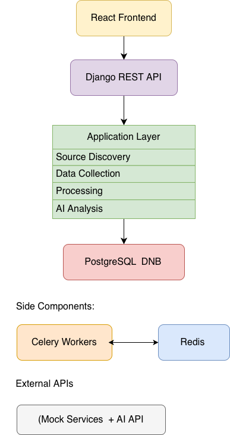
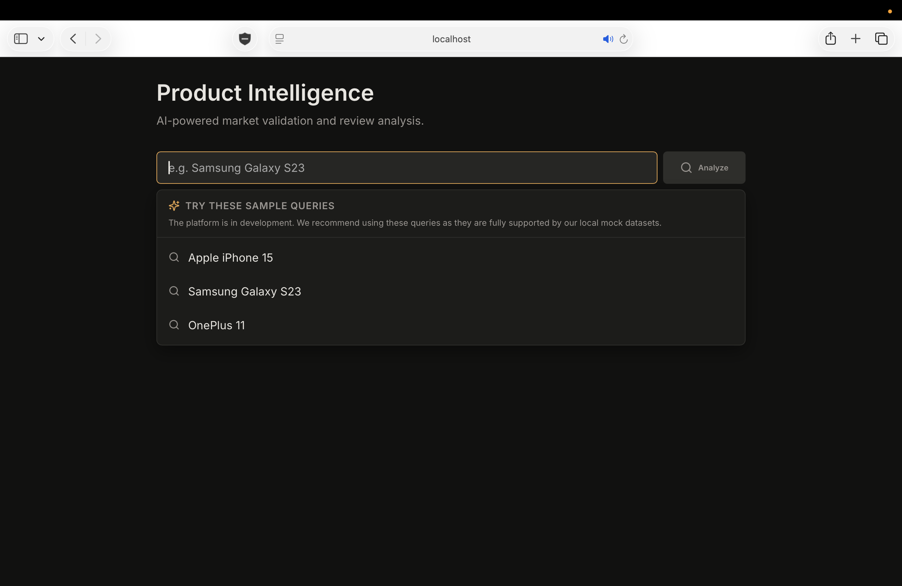
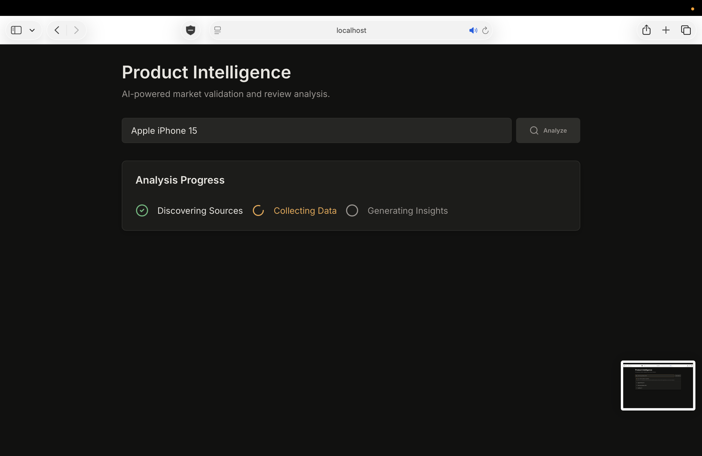
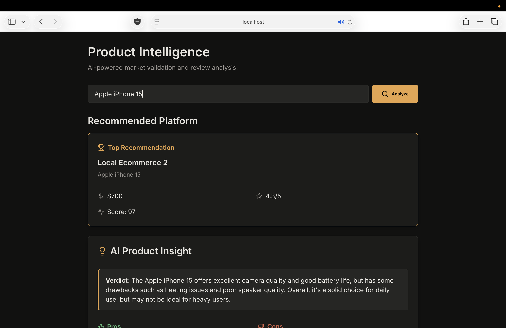

# Product Intelligence & Validation Platform

<p align="center">
  A unified platform that aggregates product data from various sources (e-commerce, reviews, YouTube) and generates granular, actionable AI-based product intelligence reports using Gemini AI.
</p>

## 🎥 Demo Video

[Watch the Demo Video 🎬](Assets/Demo_Video.mov)

---

## 📑 Table of Contents
- [Overview](#overview)
- [System Architecture](#system-architecture)
- [Key Features](#key-features)
- [Screenshots](#screenshots)
- [Tech Stack](#tech-stack)
- [Getting Started](#getting-started)
- [Project Structure](#project-structure)

---

## 🚀 Overview

In today's fragmented e-commerce ecosystem, making an informed product decision requires manually sifting through hundreds of reviews, watching multiple YouTube videos, and comparing prices across platforms. 

The **Product Intelligence & Validation Platform** automates this process. It acts as an asynchronous intelligence pipeline that gathers raw, unstructured data from disparate sources, processes it through Google's Gemini AI, and presents a cohesive, highly actionable summary. Instead of just basic sentiment analysis, it extracts detailed pros/cons, expert consensus, and comparative platform metrics.

---

## 🏗 System Architecture



The architecture relies on an asynchronous event-driven model:
1. **Frontend (React)**: Submits search queries to the backend.
2. **Backend (Django)**: Receives the request, logs the task, and queues it via Celery/Redis.
3. **Mock Services (FastAPI)**: A unified mock server simulating live APIs from multiple platforms.
4. **AI Processing (Gemini)**: The Celery worker fetches the aggregated data and prompts Gemini AI to synthesize the final intelligence report.

---

## ✨ Key Features

- **Multi-Source Data Aggregation**: Seamlessly combines data from E-commerce platforms, YouTube transcripts, and Text Reviews.
- **Asynchronous AI Pipeline**: Utilizes Celery and Redis to handle long-running AI generation tasks in the background without blocking the UI.
- **Granular AI Insights**: Leverages Gemini AI to generate expert recommendations, feature breakdowns, and sentiment analysis beyond simple positive/negative metrics.
- **Unified Mock Environment**: A self-contained FastAPI server simulating external APIs, perfect for local development and testing.
- **Premium UI/UX**: Built with React and Vite, featuring a sleek, dark-themed, responsive design with micro-animations.

---

## 📸 Screenshots

### 1. Search & Discovery

*The initial search interface featuring sample queries and a clean, responsive input field.*

### 2. Processing Pipeline

*Real-time status updates as the Celery workers aggregate data and ping Gemini AI.*

### 3. Intelligence Dashboard

*The final AI-generated report showing the synthesized insights, pros/cons, and platform comparisons.*

---

## 🛠 Tech Stack

### Frontend
- **Framework**: React.js with Vite
- **Styling**: Custom CSS with CSS Variables (Vanilla CSS)
- **Icons**: Lucide React

### Backend
- **Framework**: Django & Django REST Framework
- **Database**: SQLite (Local Dev)
- **Task Queue**: Celery with Redis broker

### AI & Data
- **AI Model**: Google Gemini AI (`google-generativeai`)
- **Mock APIs**: FastAPI (Uvicorn)

---

## 💻 Getting Started (Local Development)

Since this project utilizes an asynchronous pipeline, running the platform locally requires starting a few separate services.

### Prerequisites
- Python 3.9+
- Node.js 18+
- Redis (`brew install redis` or via Docker)

### 1. Start Redis
Ensure the Redis server is running to handle Celery tasks.
```bash
redis-server
```

### 2. Run the Mock API Services
This provides the simulated external data (E-commerce, YouTube, Reviews).
```bash
cd mock_services
source venv/bin/activate  # On Windows: venv\Scripts\activate
uvicorn mock_server:app --port 8050 --reload
```

### 3. Run the Django Backend
```bash
cd backend
source ../venv/bin/activate  # Assuming virtual environment is at project root
python manage.py runserver
```

### 4. Start the Celery Worker
Handles the background AI generation tasks.
```bash
cd backend
source ../venv/bin/activate
celery -A core worker --loglevel=info
```

### 5. Start the React Frontend
```bash
cd frontend
npm install
npm run dev
```

The application will be accessible at `http://localhost:5173`.

---

## 📁 Project Structure

```text
product-intelligence/
├── backend/               # Django API & AI Task processing
│   ├── core/              # Django settings & Celery config
│   └── products/          # Main application logic & models
├── frontend/              # React UI
│   ├── src/
│   │   ├── components/    # Reusable UI components (SearchBar, etc.)
│   │   ├── pages/         # Page layouts
│   │   └── api/           # API integration logic
├── mock_services/         # FastAPI mock servers
│   ├── ecommerce_api/     # Simulated storefronts
│   ├── youtube_api/       # Simulated video data
│   └── text_review_api/   # Simulated text reviews
└── requirements.txt       # Shared Python dependencies
```